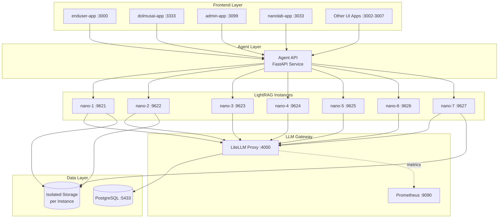
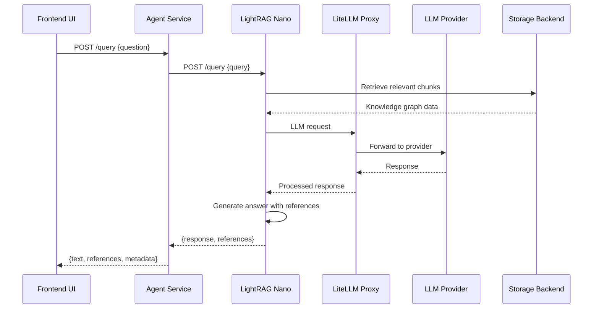

# LightRAG Application Architecture

## 🏗️ High-Level Architecture

The system is a **multi-tier RAG (Retrieval-Augmented Generation)** platform with 7 parallel LightRAG instances, centralized LLM management, and multiple specialized UIs.

### Architecture Diagram



## 📦 Core Components

### 1. **LightRAG Core** (`lightrag/`)
Graph-based RAG framework with:
- **Orchestrator**: `lightrag.py` - main RAG operations class
- **Operations**: `operate.py` - chunking, entity extraction, knowledge graph queries
- **Prompts**: `prompt.py` - LLM prompt templates
- **Storage Adapters**: `kg/` - graph, vector, and key-value storage backends
- **LLM Bindings**: `llm/` - integrations with various LLM providers
- **Utilities**: `utils.py`, `utils_graph.py` - tokenization, embeddings, graph operations

### 2. **FastAPI Service** (`lightrag-api/`)
RESTful API layer exposing LightRAG functionality:
- `lightrag_server.py` - main FastAPI application
- Routers (`routers/`) - modular endpoint handlers
- `run_with_gunicorn.py` - production WSGI server launcher
- JWT-based authentication with Bearer tokens

### 3. **Agent Service** (`agent/`)
Middleware layer that proxies requests to LightRAG instances:
- `main.py` - FastAPI service acting as intelligent router
- Routes queries from multiple UIs to appropriate LightRAG nano instances
- Handles authentication and request transformation
- Aggregates responses with references

### 4. **Web UI** (`lightrag_webui/`)
React 19 + TypeScript frontend:
- **Tech Stack**: Bun + Vite + Tailwind CSS
- **Features**: Document management, graph visualization, retrieval testing
- **Components**: `DocumentManager.tsx`, `GraphViewer.tsx`, `RetrievalTesting.tsx`
- **i18n Support**: 10 languages (en, fi, zh, ja, ru, ar, de, fr, uk, zh_TW)

### 5. **Multiple UI Applications** (`apps/`)
Specialized frontend applications for different use cases:
- **enduser-app** (port 3000): Primary end-user interface
- **dolmusai-app** (port 3333): Specialized AI interface
- **admin-app** (port 3099): Administrative dashboard
- **nanolab-app** (port 3033): Laboratory/testing interface
- **enduser-app2-7** (ports 3002-3007): Additional specialized interfaces

## 🔄 Data Flow



## 🗄️ Storage Architecture

### Multi-Instance Design
The deployment runs **7 parallel LightRAG instances** (nano-1 through nano-7):

- Each instance has **isolated storage** (`data/nano{1-7}/`)
- Separate configuration via environment files (`.env1oai`, `.env2wxai`, `.env1oaie`)
- Ports 9621-9627 for independent access
- Different LLM provider configurations per instance

### Storage Backends
Supports multiple storage adapters:
- **Graph Storage**: Neo4j, NetworkX (in-memory)
- **Vector Storage**: Qdrant, Milvus, nano-vectordb
- **Key-Value Storage**: Redis, MongoDB, PostgreSQL
- **File System**: Local persistence in `rag_storage/`

## 🔌 LLM Integration

### LiteLLM Proxy Layer
Centralized LLM gateway providing:
- **Unified API**: OpenAI-compatible interface for multiple providers
- **Load Balancing**: Distributes requests across providers
- **Monitoring**: Prometheus metrics on port 9090
- **Persistence**: PostgreSQL database for model configs and logs
- **Configuration**: `LiteLLM/config.yaml`

### Supported Providers
Based on `pyproject.toml` dependencies:
- OpenAI (GPT models)
- Anthropic (Claude)
- Google (Gemini via google-genai)
- Ollama (local models)
- AWS Bedrock (via aioboto3)
- Voyage AI (embeddings)
- Zhipu AI

## 🛠️ Key Features

### 1. **Graph-Based RAG**
- Extracts entities and relationships from documents
- Builds knowledge graph for contextual retrieval
- Supports naive, local, global, and hybrid query modes

### 2. **Document Processing**
- Chunking by token size (`operate.py`)
- Entity extraction with LLM
- Incremental knowledge graph updates
- Status tracking (`DocProcessingStatus`)

### 3. **Query Modes**
- **Naive**: Simple vector similarity search
- **Local**: Entity-focused retrieval
- **Global**: Community-based retrieval
- **Hybrid**: Combines multiple strategies

### 4. **Observability**
- Prometheus metrics collection
- LangFuse integration (optional)
- Structured logging via `utils.py`

## 🐳 Deployment

### Docker Compose Stack
The `docker-compose.yml` orchestrates:

1. **LiteLLM Stack**: Proxy + PostgreSQL + Prometheus
2. **7 LightRAG Instances**: Parallel nano services
3. **9 UI Applications**: Multiple frontend interfaces
4. **Shared Network**: `stack-net` bridge network

### Health Checks
- LiteLLM: `/health/liveliness` endpoint
- PostgreSQL: `pg_isready` command
- Service dependencies ensure proper startup order

### Volume Mounts
- Configuration: `config.ini`, environment files
- Data persistence: Per-instance storage directories
- Prometheus data: Persistent metrics storage

## 🔐 Security

- **Authentication**: JWT tokens + API keys
- **Environment Variables**: Secrets via `.env` files (never committed)
- **CORS**: Configured for cross-origin requests
- **Network Isolation**: Docker bridge network

## 📊 Testing Strategy

From `tests/` and `pyproject.toml`:
- **Pytest Framework**: Async test support
- **Markers**: `offline`, `integration`, `requires_db`, `requires_api`
- **Custom Flags**: `--keep-artifacts`, `--stress-test`, `--test-workers`
- **Coverage**: Unit tests, integration tests, storage tests

## 🚀 Development Workflow

```bash
# Backend setup
python -m venv .venv && source .venv/bin/activate
pip install -e .[api]
lightrag-server  # or uvicorn lightrag.api.lightrag_server:app --reload

# Frontend setup
cd lightrag_webui
bun install
bun run dev

# Testing
python -m pytest tests
ruff check .
bun test
```

## 📁 Project Structure

```
nano/
├── lightrag/                 # Core Python package
│   ├── lightrag.py          # Main orchestrator
│   ├── operate.py           # Core operations
│   ├── prompt.py            # LLM prompts
│   ├── kg/                  # Storage adapters
│   ├── llm/                 # LLM bindings
│   ├── api/                 # FastAPI service
│   └── tools/               # CLI tools
├── agent/                   # Agent middleware service
│   └── app/
│       └── main.py          # FastAPI proxy
├── lightrag_webui/          # React frontend
│   └── src/
│       ├── features/        # UI components
│       └── locales/         # i18n translations
├── apps/                    # Specialized UI apps
│   ├── enduser-app/
│   ├── dolmusai-app/
│   ├── admin-app/
│   └── nanolab-app/
├── tests/                   # Test suite
├── k8s-deploy/             # Kubernetes deployment
├── docs/                    # Documentation
├── docker-compose.yml       # Container orchestration
└── pyproject.toml          # Python package config
```

## 🔑 Key Technologies

- **Backend**: Python 3.10+, FastAPI, Pydantic
- **Frontend**: React 19, TypeScript, Bun, Vite, Tailwind CSS
- **LLM Gateway**: LiteLLM
- **Storage**: PostgreSQL, Neo4j, Qdrant, Redis, MongoDB
- **Monitoring**: Prometheus
- **Deployment**: Docker Compose, Kubernetes
- **Testing**: Pytest, Vitest

---

This architecture provides a scalable, modular RAG system with multiple specialized instances, centralized LLM management, and flexible storage options, all orchestrated through Docker Compose for easy deployment.